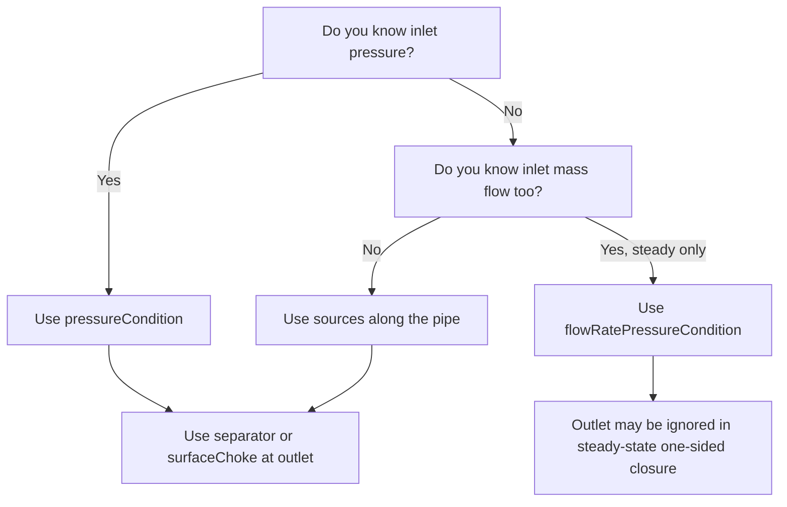

# Boundary Conditions

Boundary conditions close the 1D conservation equations by specifying what is imposed at the inlet, outlet, or service-line boundary. In Marlim3, some boundaries are configured inside `initialConfig`, while others are top-level objects.

---

## Closure Strategy

The solver needs a closure strategy for the production system:

- **Inlet-boundary driven**: use `pressureCondition` or `flowRatePressureCondition` inside `initialConfig`.
- **Source-driven**: omit inlet boundary objects and inject fluid through source accessories (`ipr`, `liquidSource`, `massSource`, `gasSource`, etc.).
- **Service-line driven**: if gas line exists, use `gasInj` for service-line inlet conditions.

If no inlet boundary object is provided, the line is treated as closed at the endpoint and inflow must come from sources inside the system.

---

## Inlet: Pressure Condition

Use this when inlet pressure is known and the solver should determine the resulting flow rate from the overall pressure balance.

What is imposed over time:

- Pressure [kgf/cm²]
- Temperature [°C]
- Fluid quality (free-gas mass divided by total associated mass)
- Complementary-fluid volumetric ratio

> **JSON key:** `initialConfig.pressureCondition` (EN) · `configuracaoInicial.condicaoPressao` (PT)
>
> **Sub-keys:**
>
> - `active` · `ativo`
> - `time` · `tempo`
> - `pressure` · `pressao`
> - `temperature` · `temperatura`
> - `fluidQuality` · `titulo`
> - `betaRatio` · `razaoBeta`

---

## Inlet: Flow-Rate + Pressure Condition

This boundary fully defines the system from the inlet side by imposing inlet pressure and inlet mass flow simultaneously. It is intended for **steady-state only**; in transient mode, outlet information is still needed because wave propagation matters.

What is imposed over time:

- Pressure [kgf/cm²]
- Temperature [°C]
- Mass flow rate [kg/s]
- Complementary-fluid ratio

> **JSON key:** `initialConfig.flowRatePressureCondition` (EN) · `configuracaoInicial.condicaoVazPres` (PT)
>
> **Sub-keys:**
>
> - `active` · `ativo`
> - `time` · `tempo`
> - `pressure` · `pressao`
> - `temperature` · `temperatura`
> - `massFlowRate` · `VazMass`
> - `betaRatio` · `razaoBeta`

---

## Inlet by Sources (No Inlet Boundary Object)

Instead of imposing conditions at the first endpoint, fluid can enter through sources positioned along the production line. This is common for wells where inflow enters at a reservoir-coupled location rather than at pipe coordinate zero.

Typical source-based inlet choices:

- `ipr` for reservoir inflow
- `liquidSource` for standard-condition liquid rate
- `massSource` for total mass inflow
- `gasSource` for gas inflow

See [accessories.md](accessories.md) for source configuration.

---

## Outlet: Separator Pressure

The standard outlet boundary is a downstream pressure schedule representing separator or receiving-manifold pressure.

> **JSON key:** `separator` (EN) · `separador` (PT)
>
> **Sub-keys:** `active` · `ativo`, `time` · `tempo`, `pressure` · `pressao`

---

## Outlet: Surface Choke

The surface choke is a fixed-position outlet restriction. Instead of imposing outlet pressure directly, you impose choke opening over time and the solver computes the resulting pressure-flow relation.

> **JSON key:** `surfaceChoke` (EN) · `chokeSup` (PT)

Main fields:

- `cvCurve` (0 = area ratio, 1 = stem displacement)
- `time` / `tempo`
- `opening` / `abertura`
- `dischargeCoefficient` / `coeficienteDescarga`
- `model` / `modelo` (currently only 0 = Sachdeva)
- `x1`, `cv1` for stem-displacement mode

---

## Reverse-Flow Prevention at Outlet

The production-system outlet can be protected by a check valve configured in `initialConfig`.

> **JSON key:** `initialConfig.checkValve` (EN) · `configuracaoInicial.CheckValve` (PT)
> Values: `0` = reverse gas inflow allowed, `1` = reverse flow blocked at last boundary

---

## Service-Line Gas Injection Boundary

When the service line exists, `gasInj` defines its inlet boundary condition.

> **JSON key:** `gasInj` (EN/PT)

Main fields:

- `bcType` / `tipoCC`
  - `0` = injection pressure
  - `1` = injection flow rate
- `time` / `tempo`
- `temperature` / `temperatura`
- `gasFlowRate` / `vazaoGas`
- `injectionPressures` / `pressaoInjecao`
- `initialFlowRateGuess` / `chuteVazaoInjecao`

!!! note
    In gas-lift unloading with automatic unloading control, the simulator can define service-line boundary conditions internally without requiring a `gasInj` object.

---

## Injection-Well Boundary Condition

Injection-well simulations use a dedicated top-level boundary object with six boundary-condition modes.

> **JSON key:** `injectionWellBC` (EN) · `CondicaoContPocInjec` (PT)

Core fields:

- `fluidType` / `tipoFluido`
  - `0` = user-provided liquid from complementary fluid
  - `1` = water (requires salinity)
  - `2` = CO2-rich gas via flash table (`.tab`)
  - `3` = CO2-rich gas via compositional model (`.ctm`)
- `pvtsimFile` / `arquivoPvtsim`
- `boundaryCondition` / `condContorno`
- `injectionTemp` / `tempInj`
- `stdLiquidFlowRate` / `vazLiq`
- `injectionPressure` / `presInjec`
- `bottomholePressure` / `presFundo`

### Boundary-condition modes

| Mode | Required quantities |
|------|---------------------|
| 0 | `stdLiquidFlowRate` + IPR |
| 1 | `injectionPressure` + IPR |
| 2 | `bottomholePressure` + IPR |
| 3 | `injectionPressure` + `bottomholePressure` |
| 4 | `stdLiquidFlowRate` + `injectionPressure` |
| 5 | `stdLiquidFlowRate` + `bottomholePressure` |

All six modes require `injectionTemp`.

### Injection-side choke

> **JSON key:** `injectionChoke` (EN) · `chokeInj` (PT)

This is a single-phase gas choke with:

- `active` / `ativo`
- `time` / `tempo`
- `opening` / `abertura`
- `dischargeCoefficient` / `coeficienteDescarga`

---

## Choosing a Boundary Strategy



Rules of thumb:

- Use `pressureCondition` when upstream pressure is the natural control variable.
- Use `flowRatePressureCondition` only for steady-state one-sided closure studies.
- Use `ipr` when inflow depends on reservoir drawdown.
- Use `separator` for simplest outlet pressure control.
- Use `surfaceChoke` when outlet restriction behavior matters.

---

## Example: Pressure Inlet + Separator

```json
{
  "separator": {
    "active": true,
    "time": [0, 3600],
    "pressure": [50.0, 45.0]
  },
  "initialConfig": {
    "pressureCondition": {
      "active": true,
      "time": [0],
      "pressure": [200.0],
      "temperature": [80.0],
      "fluidQuality": [0.0],
      "betaRatio": [0.0]
    }
  }
}
```

## Example: Service-Line Injection BC

```json
{
  "initialConfig": {
    "gasLine": true
  },
  "gasInj": {
    "active": true,
    "bcType": 0,
    "time": [0, 3600],
    "temperature": [25.0, 25.0],
    "injectionPressures": [120.0, 115.0]
  }
}
```

!!! tip
    Start with one clear closure strategy, validate steady-state first, then introduce time-varying ramps, chokes, and coupling effects.
