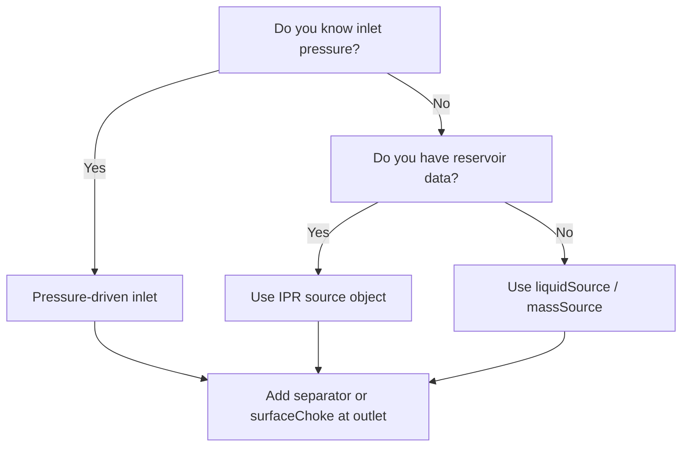

# Boundary Conditions

Internal conservation equations (mass, momentum, energy) are not sufficient by themselves to determine the solution. The solver needs information at the domain boundaries — what is imposed at the inlet and outlet of the system: pressure, flow rate, temperature, or combinations thereof, possibly varying with time.

---

## The Closure Problem

A production system is bounded by two ends:

- **Inlet** (reservoir side or upstream connection) — where fluid enters the system.
- **Outlet** (separator side or downstream connection) — where fluid leaves the system.

At each boundary, you impose physical quantities that the solver cannot determine internally. The combination of inlet and outlet conditions uniquely determines the flow solution.

**Key rule:** If no inlet boundary-condition object is defined, inflow must come from source objects (IPR, liquid source, mass source, etc.) positioned along the pipe. An outlet boundary is always required for the pressure reference.

---

## Inlet: Pressure-Driven Condition

The most natural inlet boundary for production systems where upstream pressure is known (e.g., reservoir pressure at the wellbore sandface, or pipeline inlet manifold pressure).

The simulator receives pressure, temperature, and fluid quality at the inlet as functions of time. It then determines the resulting flow rate from the pressure difference between inlet and outlet, accounting for all friction, gravity, and acceleration losses along the pipe.

**What you specify:**

- Inlet pressure over time [kgf/cm²]
- Inlet temperature over time [°C]
- Fluid quality — ratio of free-gas mass to total associated mass (gas + oil + water)
- Complementary-fluid ratio (beta) — volumetric fraction of complementary fluid

> **JSON key:** `initialConfig.pressureCondition` (EN) · `configuracaoInicial.condicaoContPressao` (PT)
> Sub-keys: `time` / `pressure` / `temperature` / `fluidQuality` / `betaRatio`

---

## Inlet: Flow-Rate + Pressure Condition

An alternative inlet boundary that fully specifies the system from the upstream side by imposing both pressure and mass flow rate simultaneously. This boundary determines the steady-state solution independently of the outlet — it is intended for **steady-state only**, since in transient mode wave propagation requires outlet information.

**What you specify:**

- Inlet pressure over time [kgf/cm²]
- Inlet temperature over time [°C]
- Mass flow rate over time [kg/s]
- Complementary-fluid ratio (beta)

> **JSON key:** `initialConfig.flowRatePressureCondition` (EN) · `configuracaoInicial.condicaoContVazaoPressao` (PT)
> Sub-keys: `time` / `pressure` / `temperature` / `massFlowRate` / `betaRatio`

---

## Inlet: Source-Based (No Boundary Object)

When no inlet boundary object is defined, fluid must enter the system through **source objects** positioned along the pipe. Common sources include:

- **IPR (Inflow Performance Relationship)** — reservoir inflow based on productivity index and drawdown.
- **Liquid source** — prescribed liquid volumetric rate at standard conditions.
- **Mass source** — prescribed total mass flow rate.
- **Gas source** — prescribed gas flow rate.

This approach is natural for well systems where the reservoir delivers fluid at a position along the production column rather than at a pipe endpoint.

> See [Accessories](accessories.md) for source configuration details.

---

## Outlet: Separator Pressure

The most common outlet boundary. Imposes a downstream pressure schedule representing the separation equipment or receiving manifold at the system exit.

**What it represents physically:** The topside separator (or subsea manifold) maintains a pressure that the production system discharges into. This pressure can change over time to represent operational scenarios (blowdown, ramp-up, etc.).

> **JSON key:** `separator` (EN) · `separador` (PT)
> Sub-keys: `active`, `time` [s], `pressure` [kgf/cm²]

---

## Outlet: Surface Choke

An alternative outlet boundary where restriction is provided by a choke rather than a fixed pressure. The choke opening schedule determines the effective flow area and thus the pressure relationship at the outlet.

> **JSON key:** `surfaceChoke` (EN) · `chokeSuperficie` (PT)

---

## Outlet: Check Valve (Reverse-Flow Prevention)

A check valve at the production-system outlet prevents gas from flowing backward into the system when downstream pressure momentarily exceeds the computed outlet pressure. Without it, reverse gas inflow is allowed at the last boundary.

> **JSON key:** `checkValve` (EN) · `CheckValve` (PT) — inside global config
> Values: `0` = no check valve (default); `1` = check valve active

---

## Gas Injection Boundary

When a service (gas) line is present, gas injection into the production system is controlled by a boundary that specifies injection flow rate and/or pressure over time.

> **JSON key:** `gasInj` (EN) · `injGas` (PT)

---

## Injection-Well Boundaries

For injector systems, the boundary condition at the injection well supports six different combinations of imposed variables, allowing flexible coupling between surface conditions and reservoir response:

| Mode | What is imposed |
|------|----------------|
| 0 | Surface flow rate |
| 1 | Surface injection pressure |
| 2 | Bottom-hole pressure |
| 3 | Surface flow rate + IPR coupling |
| 4 | Surface injection pressure + IPR coupling |
| 5 | Bottom-hole pressure + IPR coupling |

When IPR coupling is active, the reservoir responds dynamically to injection conditions.

> **JSON key:** `injectionWellBC` (EN) · `condicaoContPocInjec` (PT)
> Mode selector: `injectionWellBC.boundaryCondition`

An injection choke can also be placed at the injection side:

> **JSON key:** `injectionChoke` (EN) · `chokeInjecao` (PT)

---

## Choosing a Boundary Strategy



**Rules of thumb:**

- For well systems with known reservoir pressure → use `pressureCondition` at inlet + `separator` at outlet.
- For well systems with IPR data → use `ipr` source along the pipe + `separator` at outlet.
- For pipelines with known inlet flow → use `liquidSource` or `massSource` + `separator` at outlet.
- For steady-state-only parametric studies → `flowRatePressureCondition` fully determines the system from one side.

---

## Example: Pressure-Driven Inlet + Separator Outlet

```json
{
  "separator": {
    "active": true,
    "time": [0, 3600],
    "pressure": [50.0, 45.0]
  },
  "initialConfig": {
    "pressureCondition": {
      "active": true,
      "time": [0],
      "pressure": [200.0],
      "temperature": [80.0],
      "fluidQuality": [0.0],
      "betaRatio": [0.0]
    }
  }
}
```

## Example: Source-Based Inlet (No Inlet Boundary)

```json
{
  "separator": {
    "active": true,
    "time": [0],
    "pressure": [20.0]
  },
  "liquidSource": [
    {
      "id": 0,
      "prodFluidId": 0,
      "measuredLength": 0.1,
      "time": [0],
      "liquidFlowRate": [1500],
      "temperature": [60.0]
    }
  ]
}
```

!!! tip
    Choose one primary closure strategy first (pressure-driven or flow-driven), validate it in steady-state, and then layer secondary controls (choke schedules, time-varying ramps) for transient studies.
