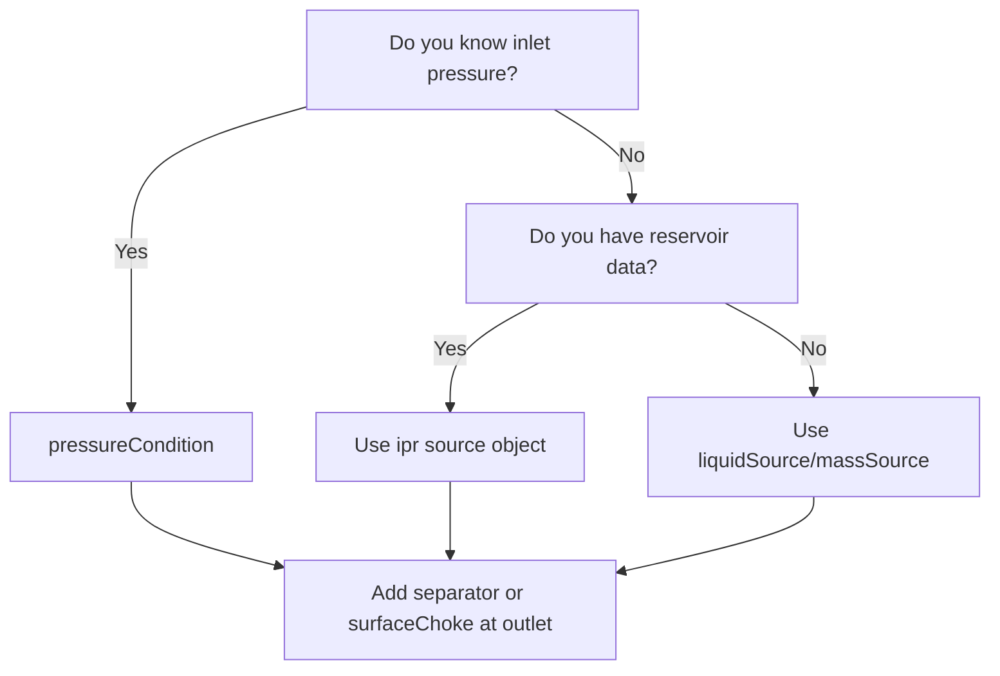

# Boundary Conditions

Boundary conditions close the mathematical problem at domain limits. They define what is imposed at the inlet and outlet of the production/injection system.

## Concept

Internal conservation equations (mass, momentum, energy) are not sufficient to determine the solution — the solver also needs information at the domain boundaries: pressure, flow rate, temperature, or combinations thereof, possibly varying with time.

**Key rule:** If no inlet boundary-condition object is present, inflow must be provided by source objects (`ipr`, `massSource`, `liquidSource`, `gasSource`, etc.) located along the pipe. If no outlet boundary is defined, the solver cannot close the pressure balance.

## Inlet Boundary Strategies

Two mutually exclusive inlet-boundary objects can be defined inside `initialConfig`:

### `pressureCondition` — Pressure-Driven Inlet

Imposes upstream pressure, temperature, and fluid quality as time-dependent vectors. The solver then determines the resulting flow rate from the pressure gradient along the system.

| Vector field | Unit | Meaning |
|-------------|------|---------|
| `time` | s | Time schedule |
| `pressure` | kgf/cm² | Fluid pressure at inlet |
| `temperature` | °C | Fluid temperature at inlet |
| `fluidQuality` | — | Ratio of free-gas mass to total associated mass (gas + oil + water) |
| `betaRatio` | — | Volumetric ratio of complementary fluid to (complementary + oil + water) |

### `flowRatePressureCondition` — Flow-Rate + Pressure Inlet

Fully specifies the system from the inlet side (pressure and mass flow rate). This boundary fully determines the steady-state solution independently of the outlet. It is intended for **steady-state only**, since transient mode also needs outlet information for wave propagation.

| Vector field | Unit | Meaning |
|-------------|------|---------|
| `time` | s | Time schedule |
| `pressure` | kgf/cm² | Fluid pressure at inlet |
| `temperature` | °C | Fluid temperature at inlet |
| `massFlowRate` | kg/s | Fluid mass flow rate at inlet |
| `betaRatio` | — | Complementary-fluid volumetric ratio |

## Outlet Boundary Objects

| Object | Location | Typical use |
|--------|----------|-------------|
| `separator` | End of production line | Downstream pressure schedule (most common outlet BC) |
| `surfaceChoke` | End of production line | Choke-based outlet with opening schedule |
| `checkValve` (in `initialConfig`) | End of production line | Prevents reverse gas inflow when `checkValve = 1` |

### `separator` Fields

| Field | Unit | Description |
|-------|------|-------------|
| `active` | bool | Whether this BC is active |
| `time` | s | Time schedule |
| `pressure` | kgf/cm² | Downstream pressure over time |

## Gas Injection and Injector Cases

| Object | Role |
|--------|------|
| `gasInj` | Service-line gas injection schedule (flow rate and pressure over time) |
| `injectionChoke` | Injection-side choke control |
| `injectionWellBC` | Injection-well closure: six combinations of imposed variables |

### `injectionWellBC.boundaryCondition` Options

The injection-well boundary supports different combinations of imposed variables:

| Code | Imposed variables |
|------|-------------------|
| `0` | Flow rate (at surface) |
| `1` | Injection pressure (at surface) |
| `2` | Bottom-hole pressure |
| `3` | Flow rate + IPR coupling |
| `4` | Injection pressure + IPR coupling |
| `5` | Bottom-hole pressure + IPR coupling |

## Choosing a Strategy



## Example JSON

```json
{
  "separator": {
    "active": true,
    "time": [0, 3600],
    "pressure": [50.0, 45.0]
  },
  "initialConfig": {
    "pressureCondition": {
      "active": true,
      "time": [0],
      "pressure": [200.0],
      "temperature": [80.0],
      "fluidQuality": [0.0],
      "betaRatio": [0.0]
    }
  }
}
```

### Source-Based Inlet (No Inlet Boundary)

When no inlet boundary object is used, sources along the pipe provide inflow:

```json
{
  "separator": {
    "active": true,
    "time": [0],
    "pressure": [20.0]
  },
  "liquidSource": [
    {
      "id": 0,
      "prodFluidId": 0,
      "measuredLength": 0.1,
      "time": [0],
      "liquidFlowRate": [1500],
      "temperature": [60.0]
    }
  ]
}
```

!!! tip
    Choose one primary closure strategy first (pressure-driven or flow-driven), validate it in steady-state, and then layer secondary controls such as choke schedules or time-varying boundary ramps for transient studies.
